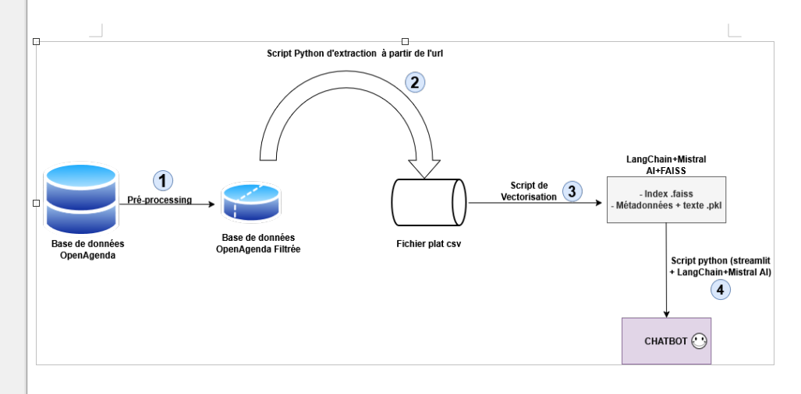

                                                        
                                                        
                                                           Puls-Events – POC Chatbot RAG Événementiel

                       1. Contexte du projet

Ce projet est un Proof of Concept (POC) réalisé pour l’entreprise Puls-Events, dont l’objectif est d’évaluer la faisabilité d’un chatbot intelligent basé sur un système de Retrieval-Augmented Generation (RAG) pour la recommandation d’événements culturels.

Le chatbot s’appuie sur :

des données d’événements publics OpenAgenda

une base de données vectorielle FAISS

des embeddings et un LLM Mistral

l’orchestration via LangChain

Le périmètre retenu pour ce POC est une zone géographique limitée ( Montpellier dans notre cas) avec uniquement des événements datant de moins d’un an (2025 dans notre cas).

                    2. Objectifs du POC

Valider la capacité de recherche sémantique sur des événements culturels

Démontrer la génération de réponses augmentées (RAG)

Évaluer la qualité des réponses via un jeu de données annoté

Fournir une base technique exploitable pour une future mise en production

                  3. Installations

- Créer un environnement virtuel et activer le.
- Installer les dépendances: pip install -r requirements.txt .

                 4. configuration. 
- Créer un fichier .env à la racine  et sauvegarder votre clé API Mistral AI  comme suit: MISTRAL_API_KEY="your_mistral_api_key".

                5- Structure du projet . 

Projet_XI/
├── .venv/                      # Environnement virtuel Python
├── .env                        # MISTRAL_API_KEY, autres secrets
├── Exxtraction.py, résultat: montpellier_2025.csv        # Données OpenAgenda nettoyées
├── reindex_langchain.py        # Script de création de l’index FAISS
├── mistrachat_langchain.py     # Application Streamlit (chatbot)
├── utils/
│   └── query_classifier.py     # Logique RAG / direct
└── data/
    └── vector_index_langchain/ # Index FAISS sauvegardé

             5-1: Récupération des données OpenAgenda

    Après les points 3 et 4, dans le CMD: exécuter  python Exxtraction.py

            5-2: Création de l'index

    - sauvegarder le fichier csv extrait dans le dossier du projet sous le nom montpellier_2025.csv.
    - Se rassurer que le fichier .env est créé et contient l'API mistral AI.
    - Exécuter dans le CMD: python reindex_langchain.py

            5-3: Interface graphique chatbot + RAG + LLM.

    - Se rassurer que le fichier query classifier existe bien dans le dossier utils qui à son tour se trouve dans le dossier du projet.
    - Exécuter dans le CMD: streamlit mistrachat_langchain.py
